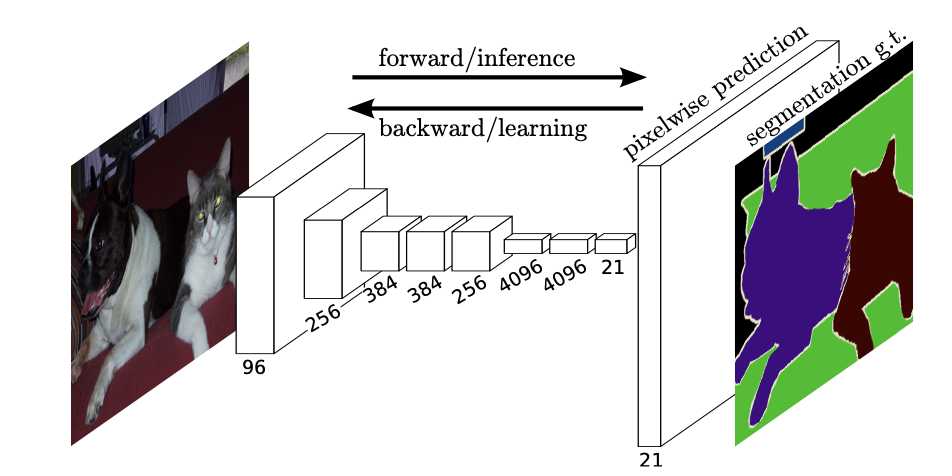

# liver-tumor-segmentation
Author: [Kyuhee Jo](kjo3@jhu.edu)

This respository contains Keras scripts to conduct liver tumor segmentation using segmentation models such as U-Net and Residual U-Net.
You can experiment with multiple combinations of segmentation models and losses implemented in models.py and loss.py. 

## Dataset

Download data from [Liver Tumor Segmentation Challenge](https://competitions.codalab.org/competitions/17094) and convert DICOM data to sequences of 2D images. 

## Model

### U-Net

[U-net](https://lmb.informatik.uni-freiburg.de/people/ronneber/u-net/) is a convolutional neural network with encoder-decoder architecture and skip-connections, loosely defined under the concept of "fully convolutional networks." U-net was originally proposed for the semantic segmentation of medical images and is modified for solving a wider range of gridded learning problems.

### Fully convolutional network 

[Fully Convolutional Networks](https://arxiv.org/abs/1411.4038), or FCNs, are an architecture used mainly for semantic segmentation. They employ solely locally connected layers, such as convolution, pooling and upsampling. Avoiding the use of dense layers means less parameters (making the networks faster to train).

### Residual U-Net

[ResUNet](https://arxiv.org/pdf/1711.10684.pdf) is a semantic segmentation model inspired by the deep residual learning and UNet. It is an architecture that take advantages from both(Residual and UNet) models.

## Results

