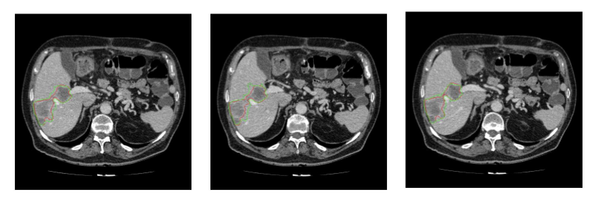

# liver-tumor-segmentation
Author: [Kyuhee Jo](kjo3@jhu.edu)

This respository contains Keras scripts to conduct liver tumor segmentation using segmentation models such as U-Net and Residual U-Net.
You can experiment with multiple combinations of segmentation models and losses implemented in models.py and loss.py. 

## Dataset

Download data from [Liver Tumor Segmentation Challenge](https://competitions.codalab.org/competitions/17094) and convert DICOM data to sequences of 2D images. 

## Model

### U-Net

### Residual U-Net

## Results

